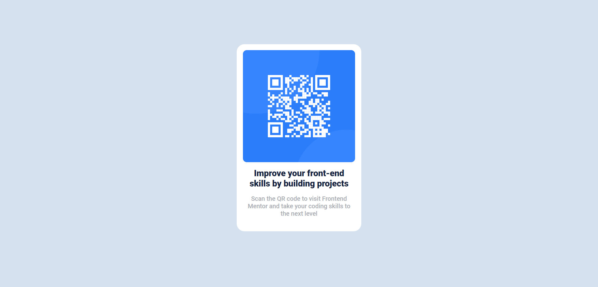

# Frontend Mentor - Social links profile solution

This is a solution to the [Social links profile challenge on Frontend Mentor](https://www.frontendmentor.io/challenges/social-links-profile-UG32l9m6dQ). Frontend Mentor challenges help you improve your coding skills by building realistic projects. 

## Table of contents

- [Overview](#overview)
  - [The challenge](#the-challenge)
  - [Screenshot](#screenshot)
  - [Links](#links)
- [My process](#my-process)
  - [Built with](#built-with)
- [Author](#author)

## Overview

### The challenge

Users should be able to:

- See hover and focus states for all interactive elements on the page

### Screenshot

### Links
- Solution URL: [click here](https://www.frontendmentor.io/solutions/qr-code-component-solution-using-vanilla-css-_9MbuCmO1w)
- Live Site URL: [click here](https://qr-code-sigma-nine.vercel.app/)

## My process

### Built with

- Semantic HTML5 markup
- CSS 
- Flexbox
- CSS Grid

## Author

- Website - [Sahil Kumar Ray](https://sahiwl-me.vercel.app/)
- Frontend Mentor - [@sahiwl](https://www.frontendmentor.io/profile/sahiwl)
- Twitter - [@sahilwithocd](https://www.twitter.com/sahilwithocd)
